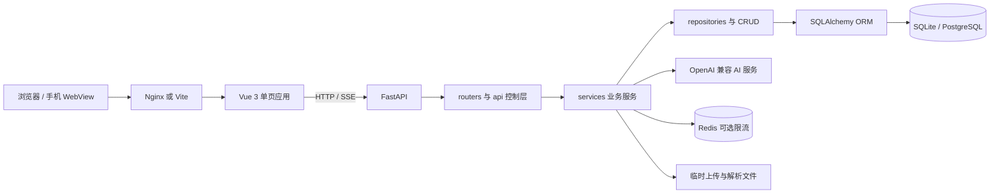
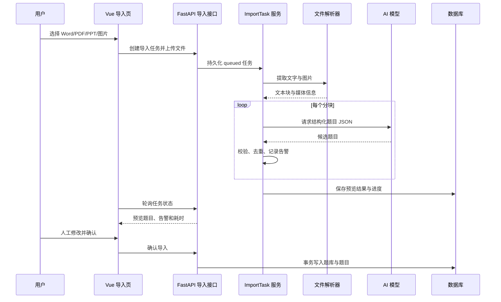
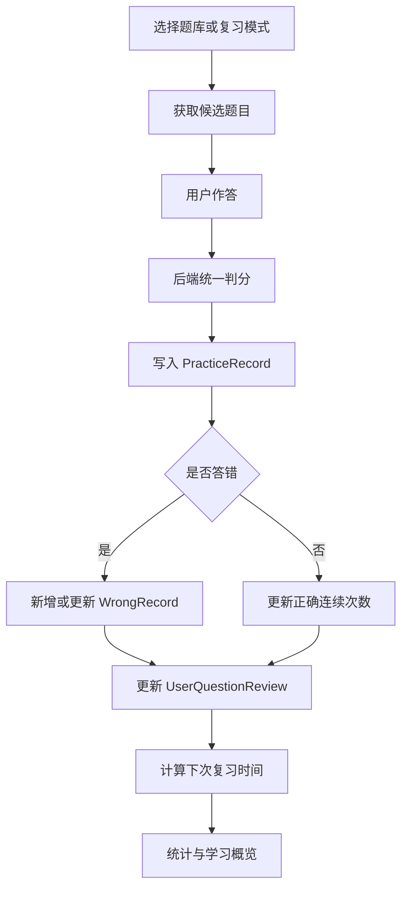

# 系统架构与核心流程

## 1. 总体架构

前端负责页面、交互、路由和客户端状态；后端负责认证授权、业务规则、数据一致性、文件解析和 AI 调用。Nginx 在容器部署中同时提供静态资源和 API 反向代理，后端不直接暴露到公网。

## 2. 分层与目录映射

| 层次 | 主要目录 | 职责 |
| --- | --- | --- |
| 表现层 | `frontend/src/views/`、`frontend/src/components/` | 页面、组件、响应式布局和可访问性 |
| 前端应用层 | `frontend/src/composables/`、`frontend/src/stores/` | 会话状态、练习流程、导入任务和主题状态 |
| 前端接口层 | `frontend/src/api/` | 请求封装、错误处理和接口类型 |
| 后端控制层 | `backend/routers/`、`backend/api/` | 参数校验、认证依赖、响应模型和状态码 |
| 后端业务层 | `backend/services/`、`backend/imports/` | 考试、统计、导入、权限和 AI 编排 |
| 数据访问层 | `backend/repositories/`、`backend/crud_*.py` | 查询、持久化和事务操作 |
| 数据模型层 | `backend/models.py`、`backend/schemas.py` | ORM 实体和 API 数据契约 |
| 基础设施层 | `backend/database.py`、`backend/config.py`、`backend/ratelimit.py` | 数据库、环境配置、日志和限流 |

`routers/` 与 `api/` 并存是当前实现状态。后续应按业务域逐步统一，但不应为了目录整齐一次性迁移全部接口。

## 3. 功能模块

| 模块 | 主要能力 | 后端入口 |
| --- | --- | --- |
| 用户与权限 | 注册、登录、游客、角色、管理员 | `auth.py`、`admin.py`、`permission_service.py` |
| 题库与题目 | 私有/公开题库、分享、复制、题目管理 | `courses.py`、`questions.py`、`library.py` |
| AI 导入 | 文档提取、切块、AI 解析、预览、确认 | `imports.py`、`backend/imports/`、`import_task_service.py` |
| 练习与复习 | 随机练习、判题、错题、间隔复习 | `practice.py`、`wrongbook.py`、`practice_service.py` |
| 正式考试 | 创建、发布、作答、评分、排行榜 | `api/exams.py`、`exam_service.py` |
| 学习分析 | 活跃度、题型正确率、知识点和课程统计 | `api/analytics.py`、`analytics_service.py` |
| 协作功能 | 学习小组、共享题库与考试 | `study_groups.py`、协作关系表 |
| 反馈与运营 | 收藏、反馈处理、公告与管理统计 | `bookmarks.py`、`feedback.py`、`admin.py` |

## 4. AI 导入流程

该流程的关键设计不是“AI 自动写库”，而是“异步任务 + 持久预览 + 人工确认”。这样可以在模型超时、返回非 JSON 或用户离开页面时保留恢复能力。

## 5. 练习闭环

`client_submission_id` 与用户组成唯一约束，用于降低离线重试或网络重发造成重复练习记录的风险。

## 6. 安全与部署边界

- 浏览器认证优先使用 HttpOnly Cookie，同时保留 Bearer Token 兼容客户端。
- 公开部署必须使用非默认 `SECRET_KEY`、`INVITE_CODE` 和明确的 `CORS_ORIGINS`。
- AI 对话与导入有用户级限流；多实例部署应配置 Redis。
- 文件上传先校验类型和体积，临时文件与日志不能进入 Git。
- 数据库结构由 Alembic 迁移维护，禁止通过删除正式数据库解决升级问题。
