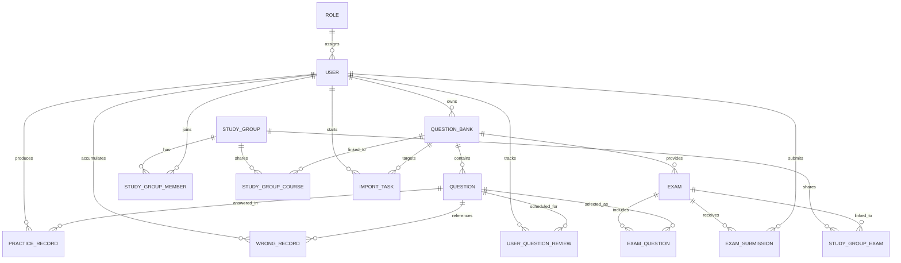

# 数据库设计

## 1. 设计目标

数据库需要同时支持题库所有权、公开资源、练习历史、错题聚合、间隔复习、正式考试、学习小组和可恢复的 AI 导入任务。开发环境使用 SQLite，生产环境推荐 PostgreSQL；表结构由 SQLAlchemy 模型和 Alembic 迁移共同维护。

## 2. 核心实体分组

| 业务域 | 表 |
| --- | --- |
| 用户与权限 | `users`、`roles` |
| 题库内容 | `question_banks`、`questions`、`tags`、`question_tags` |
| 公开资源 | `course_favorites`、`course_reports`、`collaborations` |
| 学习过程 | `practice_records`、`wrong_records`、`user_question_reviews`、`bookmarks`、`study_goals` |
| 考试 | `exams`、`exam_questions`、`exam_submissions` |
| 学习小组 | `study_groups`、`study_group_members`、`study_group_courses`、`study_group_exams` |
| 运维与反馈 | `import_tasks`、`feedback_entries` |

## 3. 核心 ER 图

## 4. 关键约束

| 约束 | 目的 |
| --- | --- |
| `users.username` 唯一 | 防止重复账号 |
| `(user_id, client_submission_id)` 唯一 | 防止练习请求重放产生重复记录 |
| `(user_id, question_id)` 在复习、收藏表唯一 | 每个用户对每题仅维护一份状态 |
| `(course_id, user_id)` 在收藏与协作表唯一 | 防止重复收藏或重复授权 |
| `(group_id, user_id/course_id/exam_id)` 唯一 | 防止学习小组关系重复 |
| `share_token`、`share_code` 唯一 | 保证分享入口可确定定位资源 |

## 5. 删除策略

- 用户删除后，其私有题库、练习、错题和反馈使用级联删除，避免孤立个人数据。
- 题目或题库删除时，历史练习中的外键允许置空，用于保留统计事实。
- 考试与试题关联、学习小组关联使用级联删除，避免失效关联。
- 角色删除时用户的 `role_id` 置空，应用层按学生角色处理。

## 6. 字段设计说明

- `Question.options`、`image_urls` 和若干任务结果当前以 JSON 文本保存，兼容 SQLite 且实现简单；若改用 PostgreSQL，可评估 JSONB 与索引。
- `is_correct`、`is_guest` 等布尔语义当前使用整数表示，兼容 SQLite；论文中应说明 `0/1` 映射。
- `ImportTask` 保存任务状态、进度、预览、告警、耗时和错误信息，使长任务可恢复，而不是依赖前端页面一直打开。
- 时间统一按 UTC 写入，展示时由客户端转换为本地时区。

## 7. 迁移管理

迁移文件位于 `backend/migrations/versions/`，当前从 `0001_initial_baseline.py` 按顺序演进。修改模型后应生成并审查 Alembic 迁移，然后分别在空数据库和旧版本数据库上验证 `upgrade head`。
